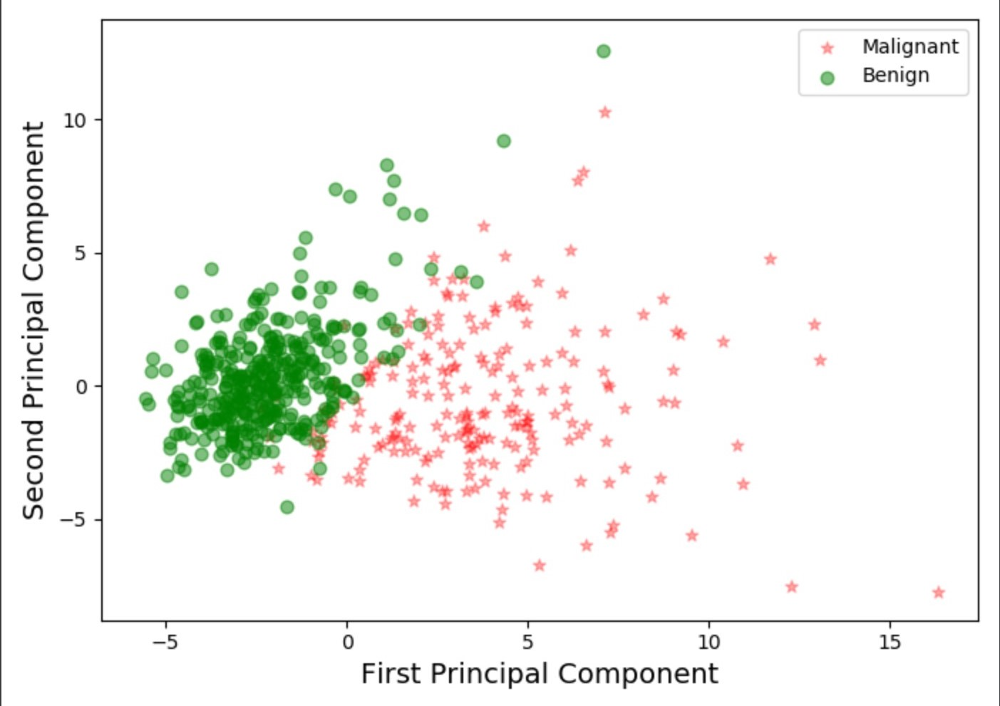
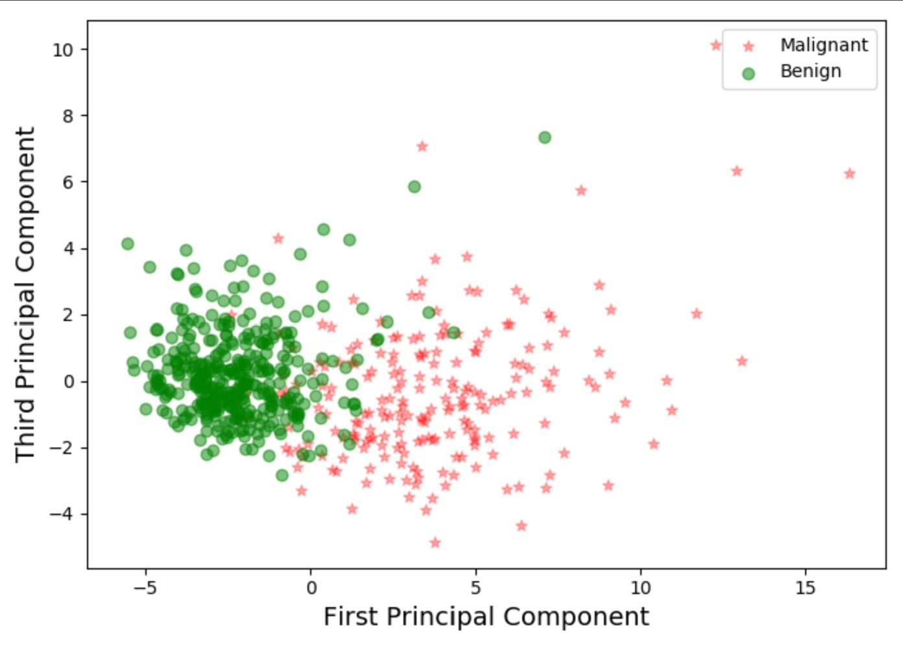
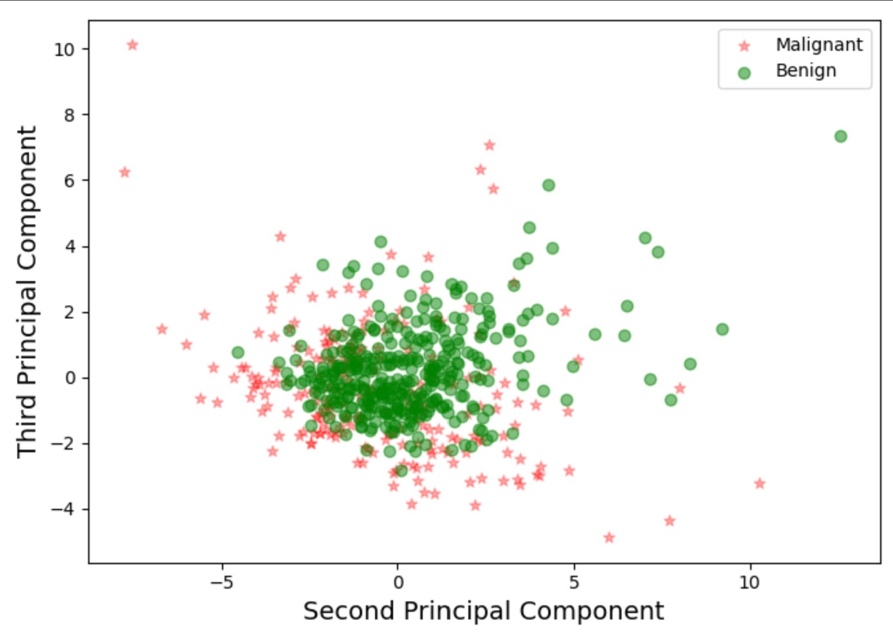
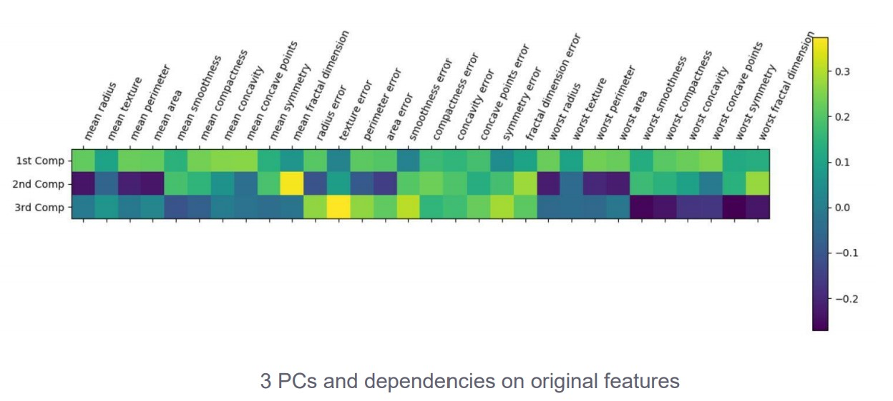

# TNM108
Part 1
Questions
1.	What are the relevant features of the Titanic dataset. Why are they relevant?
    Den data som är mest relevant är kön, klass och ålder. Den data är mest relevant då dessa parametrar ger info om den
    statistik som vi redan är medvetna om, att kvinnor, barn och högre klasser prioriterades vid utrymning av skeppet. 
2.	Can you find a parameter configuration to get a validation score greater than 62%?
    Nej det går inte att ändra på några parametrar så man får bättre resultat. 
3.	What are the advantages/disadvantages of K-Means clustering?

Man vill använda KMeans när man ha få dimensioner. Numersik data.

Fördelar:
-	Bra för att hantera omärkt data så man kan dra sina egna slutsatser.
-   Enkel att implementera
-   Anpassad till stor data
-   

Nackdelar
-	K-means är känslig mot outliers och man kan få andra resultat om man ändrar något i datan.
-	Man måste i förväg specificera antalet kluster
-	Lazy Learner, förklara Kmeans
-	Kan inte hantera saknade värden.

4.	How can you address the weaknesses?
-   En lösning till outliers är att klipper (clipping) bort outliers innan man skapar klustret.
-   En lösning till tomma värden, man kan antingen ta bort den raden eller lägga till ett värde i den raden där det saknas info.
    Det man kan göra när man lägger till är att antingen tilldela den tomma platsen värdet 0 som skiljer sig från andra värden i 
    datasetet. Man kan också ta ett slumpmässigt valt värde från en annan kolumn. Man hittar på ett värde för att fylla det.
    Man kan ta medelvärdet eller medianen av hela den kolumnen där ett värde saknas. Eller så kan man uppskatta ett värde 
    från en annan maskininlärningsmodell.
-   Att man måste i förväg specificera K; Man måste alltid välja K i förväg, men man kan ta hjälp av tekniker som optimerar
    det värde man ska ha på K. 

Part 2

1. How many clusters do you have? Explain your answer.
-  Man kan antingen dela upp det i tre olika kluster, om man drar den horisontella linjen så den krossar de blå linjerna. Eller så
kan man dela upp det i fem kluster. Sen blir det lite för rörigt med fler kluster, men 8 skulle möjilgtvis också gå.

2. Plot with AggloerativeClustering
-  Vi har tre stycken kluster. Man kan se de olika klusterna i tre olika färger och man kan se att de kluster som har samma 
    färg också ligger nära varandra.

3. What can you conclude by looking at the plot?
-  Man skulle vilja dela upp det i fem stycken kluster.Ett kluster i vardera hörn och sen ett kluster i mitten. Man kan se en
ganska jämn uppdelning av olika grupper. 

Fördelen med hiearkisk klustering är att man inte behöver specificera antalet kluster. Unlabeled data

Nackdel är att den kan vara långsam. 

Man kan få olika uppdelningar beroende på vilken nivå man tittar på.

Part 3
PCA är bra att använda om man jobbar med flera dimensioner.

1. Can you choose n_components=2? Can you think of some method to test this? 
- You can check by measuring the variance ratio of the principal components. So here you can see that the first 2 components contribute to 87% of the total variance. So it’s good enough to choose only 2 components. 

2. Create the scatter plot of the third principal component (that is, you combine the third
principal component with the first and then the second principal component). What can you see with the plot? What is the difference?]
- Resultatet vi får när vi plottar alla komponenter bredvid varandra är att komponent ’1’ kombineras bra med ’2’ och ’3’. Det blir en tydlig uppdelning mellan malignant och benign i de plottarna. Däremot blir uppdelningen inte lika bra mellan komponenterna ’2’ och ’3’.

3. Can you tell which feature contribute more towards the 1st PC? 
- Mean concavity and mean concave points look to be the most important features for the 1st comp.

